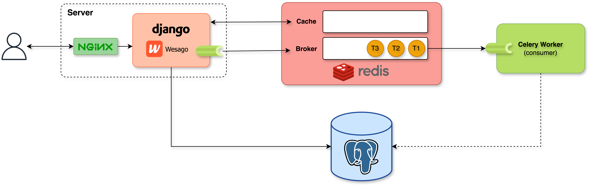

# Architecture

## Software and key technologies

- **Django** is the framework used to build the web application. It is a high-level Python Web framework that encourages rapid development and clean, pragmatic design.

- **NGINX** is used as a reverse proxy to handle incoming HTTP requests and acts as a load balancer to distribute incoming traffic across multiple Django application instances.

- **PostgreSQL** is the database used to store the data. It is a powerful, open-source object-relational database system.

- **Celery** is used to handle asynchronous tasks. It is a distributed task queue that is used to handle a vast number of messages or tasks. It can be scaled horizontally to handle a large number of messages.

- **Redis** is used as a cache and message broker for Celery.

- **Docker** is used to containerize the application and its dependencies.

:::info

New technologies will be added as the project progresses, for example, **Gunicorn**, **Rsyslog**, **Kubernetes**, etc.

:::

## Initial Architecture

:::info

Minimum Requirements: 1GB RAM, 1 CPU, 10GB storage and Docker installed.

:::

## Deployment strategy

The deployment strategy used in this project is a combination of Docker, Kubernetes and virtual machines. Docker is used to containerize the application and Kubernetes is used to orchestrate the containers. Each service is containerized and deployed as a separate container in a virtual machine.
