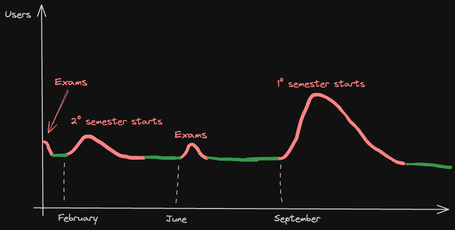

# Scenarios

## Types of users

- **Guest:** A user who is not logged in.

- **User:** A user who is logged in.

- **Moderator:** A user who is responsible for moderating a specific category.

- **Admin:** A user who has administrative privileges.

## Number of users

:::info

The number of users accessing the platform may vary according to the academic calendar.

:::
